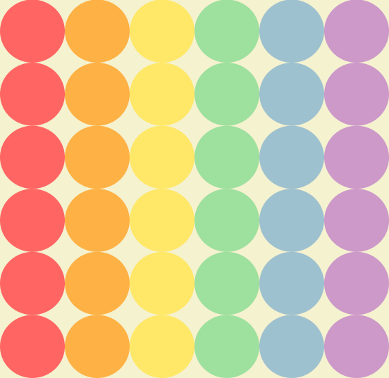

# Generating Art
A repo to generate algorithmic art using python, focusing on fractals.

## Getting Started

Just run any of the Python files to generate the corresponding GIF. For example:

```
python3 SierpinskiCarpet.py
```
or

```
python3 SierpinskiTriangle.py
```

or

```
python3 circles.py
```

## Algorithmic Art in this repo

### Sierpinski Carpet


The construction of the Sierpinski carpet begins with a square. The square is 
cut into 9 congruent subsquares in a 3-by-3 grid, and the central subsquare is 
removed. The same procedure is then applied recursively to the remaining 8 
subsquares, ad infinitum.

### Sierpinski Triangle


The Sierpiński triangle (sometimes spelled Sierpinski), also called the 
Sierpiński gasket or Sierpiński sieve, is a fractal attractive fixed set with 
the overall shape of an equilateral triangle, subdivided recursively into 
smaller equilateral triangles.

### Rainbow Circles



A grid of circles that change colours based on a rainbow pattern. First time
using ImageIO.


## Built with

* [PIL](https://en.wikipedia.org/wiki/Python_Imaging_Library) - Python Imaging 
Library (abbreviated as PIL) (in newer versions known as Pillow) is a free and 
open-source additional library for the Python programming language that adds 
support for opening, manipulating, and saving many different image file formats. 

* [ImageIO](https://imageio.readthedocs.io/en/stable/) - Imageio is a Python 
library that provides an easy interface to read and write a wide range of image
 data, including animated images, volumetric data, and scientific formats. It 
 is cross-platform, runs on Python 3.5+, and is easy to install.

## Acknowledgments

Thanks to the [#100DaysOfCode](https://twitter.com/search?q=%23100daysOfCode&src=hashtag_click)
 Twitter community for encouraging me to code for fun!!
 
### Helpful links and tutorials I used:
Sierpinski Triangle: https://www.youtube.com/watch?v=IRY1HoU2Qo0


#### Happy coding :) 